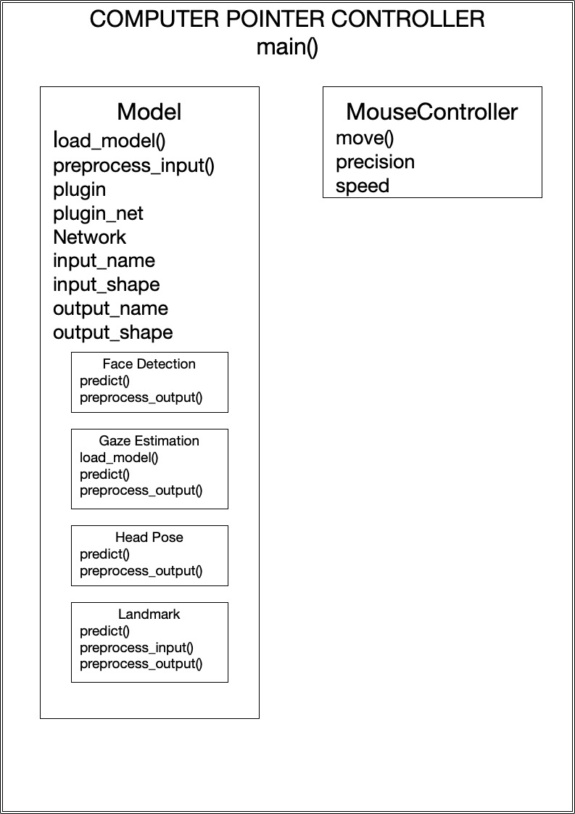

# Computer Pointer Controller

This program looks to perform inference on video to understand where a person is looking, and using this to control the computer's mouse pointer. In particular, using OpenVINO technologies to best optimize the models used, allowing for realtime machine learning inference. Below details the underlying archtechture, logic, how to demo the application, and the conclusions reached from testing. 

## Prerequisite/Installation
The program requires OpenVINO to perform the majority of the tasks. Find the installation guide for Intel® Distribution of OpenVINO™ toolkit:
- [Linux](https://docs.openvinotoolkit.org/latest/_docs_install_guides_installing_openvino_linux.html)
- [Windows](https://docs.openvinotoolkit.org/latest/_docs_install_guides_installing_openvino_windows.html)
- [MacOS](https://docs.openvinotoolkit.org/latest/_docs_install_guides_installing_openvino_macos.html)

After installing OpenVINO toolkit, following commands:
**1. Initial Setup**
```
git clone https://github.com/Zainrax/Computer-Controller-Pointer-OpenVINO.git
cd Computer-Controller-Pointer-OpenVINO
source /opt/intel/openvino/bin/setupvars.sh -pyver 3.5
pip install -r requirements.txt
```
**2. Model Download**
*Note: this downloads all precisions, use --precisions flag to specify precision type. More details found [here.](https://docs.openvinotoolkit.org/latest/_tools_downloader_README.html)*
```
python /opt/intel/openvino/deployment_tools/tools/model_downloader/downloader.py --name "face-detection-adas-binary-0001"
python /opt/intel/openvino/deployment_tools/tools/model_downloader/downloader.py --name "head-pose-estimation-adas-0001"
python /opt/intel/openvino/deployment_tools/tools/model_downloader/downloader.py --name "landmarks-regression-retail-0009"
python /opt/intel/openvino/deployment_tools/tools/model_downloader/downloader.py --name "gaze-estimation-adas-0002"
```

## Usage/Demo
Once you have the models downloaded and prerequisites installed, we can run the program:
```
cd src/
python main.py -i <mp4 video file path/"cam"> \
-fd <path to .xml face decetection model > \
-fl <path to .xml landmarks model > \
-g <path to .xml gaze estimation model> \
-p <path to .xml head pose estimation model>
```


## Documentation
### File Structure
All python files can be found in src/ including
- [main.py](src/main.py)
- [model.py](src/model.py)
- [model_face_detection.py](src/model_face_detection.py)
- [model_gaze.py](src/model_gaze.py)
- [model_head_pose.py](src/model_head_pose.py)
- [model_landmark.py](src/model_landmark.py)
- [mouse_controller.py](src/mouse_controller.py)
### Arguments Available
```
  -h, --help            show this help message and exit
  -fd FACE_DETECTION, --face_detection FACE_DETECTION
                        Path to an xml file for the face detection model.
  -fl FACE_LANDMARK, --face_landmark FACE_LANDMARK
                        Path to an xml file for the face landmark model.
  -g GAZE_DETECTION, --gaze_detection GAZE_DETECTION
                        Path to an xml file for the gaze estimation model.
  -p POSE_DETECTION, --pose_detection POSE_DETECTION
                        Path to an xml file face pose detection model.
  -i INPUT, --input INPUT
                        Path to video file, or cam for Web Cam Usage.
  -pt PROB_THRESHOLD, --prob_threshold PROB_THRESHOLD
                        Probability threshold for detections filtering(0.5 by
                        default)
  -l CPU_EXTENSION, --cpu_extension CPU_EXTENSION
                        MKLDNN (CPU)-targeted custom layers.Absolute path to a
                        shared library with thekernels impl.
  -d DEVICE, --device DEVICE
                        Specify the target device to infer on: CPU, GPU, FPGA
                        or MYRIAD is acceptable. Sample will look for a
                        suitable plugin for device specified (CPU by default)
  -v, --visual          Enable visualization on the intermediate models
  -nm, --no_move        Disables the movement of the mouse
```
### Software Architecture

### Logic Diagram

## Benchmarks
[cProfile](https://docs.python.org/3.8/library/profile.html) was the main tool in profiling inference times of all OpenVIO models. 
Results of the recommended usage can found in [main.prof](src/main.prof), which can be visualized using [SnakeViz](https://jiffyclub.github.io/snakeviz/) to better understand the results.
Below is the Inference Times of each model using different precisions available to each model 
*Note: not all models had the same precisions, only bin size is considered, and inference time is calculated based on the average of cumulitive time ub subroutines for the predict funcion*
### Face Detection
|  Precision |  Inference Time  | Size |
|---|---|---|
| FP32-INT1 |  0.009545 |  1.8MB |
### Landmarks
|  Precision |  Inference Time | Size |
|---|---|---|
|  FP32 |  0.0006881 |  7.6MB |
|  FP16 |  	0.0006823 |  3.8MB |
|  FP16-INT8 |  0.0006811 |  2.1MB |
### Head Pose
|  Precision |  Inference Time | Size |
|---|---|---|
|  FP32 |  	0.001317 |  7.5MB |
|  FP16 |  0.001361 |  3.8MB |
|  FP16-INT8 |  0.001177 |  2.1MB |
### Gaze Estimation
|  Precision |  Inference Time | Size |
|---|---|---|
|  FP32 |  	0.001501 |  762KB |
|  FP16 |  	0.001501 |  381KB |
|  FP16-INT8 |  0.001175 |  245KB|

## Results
The benchmark shows the precision does have some trade-offs between precision, time, and size. The results however can not tell us the exact accuracy lose, but there were no noticeable anomilies in interchanging the precision.
Based on the results, the differeence between our FP32 and FP16 inference time gives us no sigificant improvement with the higher precision, and the FP16 would be preferred in this regard due the size halving in all cases.
The difference between out INT8 and FP16, though we get some inference time improvements the size difference in significantly less.
While I can not comment on the exact accuracy, lowering the percision tends to have an impact on the overall output. Thus it's important to consider it on a case by case bases, where it may be preferred when you have size restrictions.

## Handling Edge Cases
The models rely on several inputs from previous inferences or images. It was thus important to have some checking of input validaty, and to see if we could create a robust system that could handle anomalies. In most cases if the model was unable to find the proper output we would move on to the next frame. This prevents inference on bad inputs, but does not make the system robust.
In the case of the Landmarks model,  even if there were not certain facial features available it would still give us some output. In our case we relied on the eyes, but there will be occurances that we either have no eyes, or one eye. In the case of no eyes we simply have to move to the next frame, but in the case of one eye, we can safely copy the other eye to predict the gaze. Of course this is not perfect (in case of crossed eyed, or other outliers) but it adds the layer of robustness we seek.
 